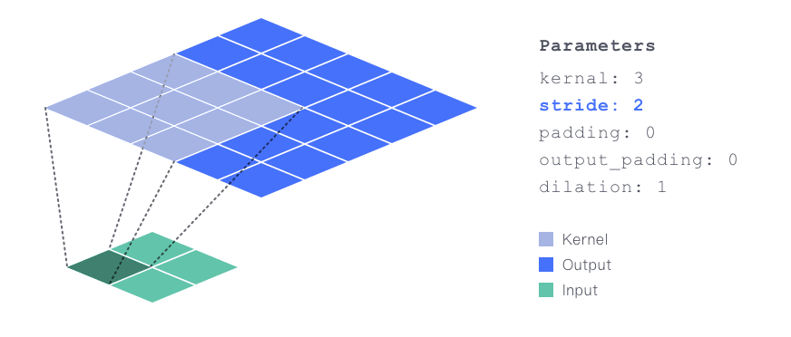
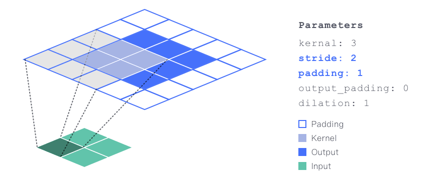
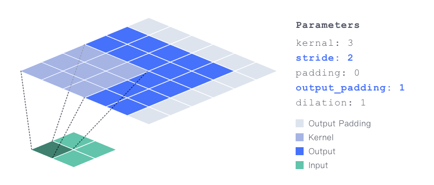
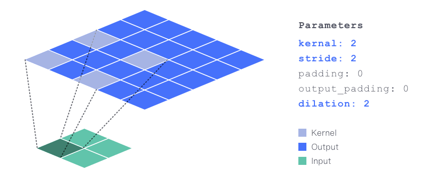

# Demystify-Transposed-Convolutional-Layers

This repository contains visualization and PyTorch code of the tutorial: 

* Sicong Zhao, Duke University - **[Demystify Transposed Convolutional Layers](https://medium.com/@luo9137/demystify-transposed-convolutional-layers-6f7b61485454)** 

It contains:

> * [Animation](./animation): visualization source files
> * [Calculation processes](./calculation%20processes): visualization of calculation processes, and derived math functions
> * [Code](./code): PyTorch implementation of each visualized cases

### Visualizations of Transposed Convolutional Layers

**Case1 Basic**

**Case2 Stride**

**Case3 Padding**

**Case4 Output Padding**

**Case5 Dilation**

### **Acknowledgment**

The style of animation design is inspired by [**conv_arithmetic**](https://github.com/vdumoulin/conv_arithmetic).

